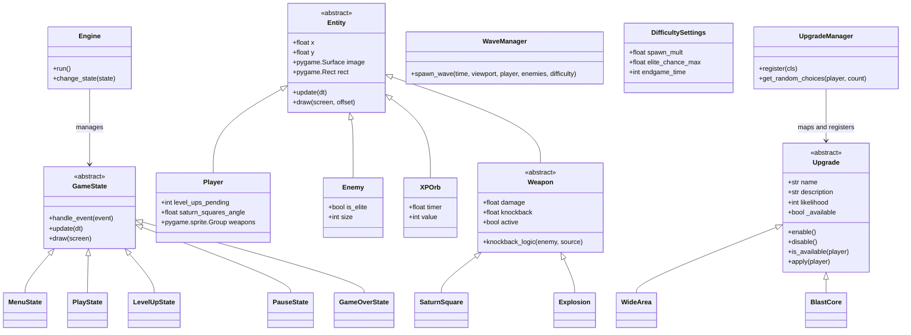

Square Survivor is a modular, Object-Oriented 2D roguelike survival game built with Python and `pygame-ce`. The initial HTML5 prototype was completely decoupled and restructured natively for scalable, standalone Windows `.exe` packaging.

---

## 🕹️ Controls

| Action | Gameplay Key | Menu Key | Controller (PS4/Xbox) |
| :--- | :--- | :--- | :--- |
| **Move / Navigate** | `W, A, S, D` / Arrows | `W, A, S, D` / Arrows | **Left Analog Stick** (Flick) / **D-Pad** |
| **Dash / Confirm** | `SPACE` | `SPACE` / `ENTER` | **X Button** (PS4) / **A Button** (Xbox) |
| **Selection** | Mouse | Mouse Hover | Joystick Movement |
| **Action** | Auto-Attack | Left Click / Key Submit | Confirm Button |
| **Pause / Back** | `ESC` | `ESC` | **Circle (PS4)** / **B (Xbox)** |

---

## 📐 Architecture & Classes

The engine employs a highly decoupled architecture utilizing standard game design patterns like State Machines, Entity Component concepts, and Strategy Registries. 



---

## 🛠️ How to Add New Game Elements

The game is designed to be easily extensible. All major game systems run autonomously and can be appended to.

### 1. Implementing a New Upgrade

Upgrades use an **Automatic Registry Pattern**. You do not need to wire them into the game's core loop or states manually! 

To add a new power-up variation:
1. Identify the relevant category file in `src/square_survivor/systems/upgrade_system/` (e.g., `player_upgrades.py`).
2. Create a new class that inherits from `Upgrade`.
3. Give it a `name`, a `description` property, and implement what happens inside `apply()`.
4. (Optional) Set a custom `likelihood` value (default is 100).
5. Drop the `@UpgradeManager.register` decorator exactly above it.

**Example implementation for "Iron Skin":**
```python
# src/square_survivor/systems/upgrade_system/player_upgrades.py

@UpgradeManager.register
class IronSkin(Upgrade):
    name = "Iron Skin"
    description = "Permanent +2.0s Invulnerability per Hit"
    likelihood = 50  # 2x rarer than default upgrades
    
    def apply(self, player: Player):
        player.base_invuln_time += 2.0 
```

### 2. Balancing & Availability

Upgrades can be dynamically enabled or disabled, and their rarity can be tuned.

**Likelihood (Weights):**
The `likelihood` attribute determines how often an upgrade appears. 
- `likelihood = 100` (Default)
- `likelihood = 10` (Rare, 10x less likely)
- `likelihood = 500` (Common, 5x more likely)

**Enable/Disable Logic:**
You can remove an upgrade from the selection pool programmatically. For example, to disable an upgrade after it has been picked enough times:
```python
    def apply(self, player: Player):
        player.some_stat += 1
        if player.some_stat >= 5:
            self.disable()  # Removes this upgrade from future level-up menus
```

---

### 3. Modifying the Upgrade Screen (Level-Up UI)

The visual elements of the upgrade interface live inside the **`LevelUpState`** class, located inside `src/square_survivor/states/level_up.py`.

The UI now supports a **Dynamic Grid Layout** that automatically:
- Respects the player's `upgrade_choices` count.
- Handles up to 7 upgrades simultaneously.
- Wraps buttons after 4 items per row and centers them horizontally and vertically.
- **Keyboard Support**: Fully navigable using `W, A, S, D` with `SPACE` to confirm.

If you want to modify the display:
1. Open `src/square_survivor/states/level_up.py`.
2. Locate the `LevelUpState` class.
3. The layout logic is handled in `__init__`, where `grid_start_y` and `row_start_x` calculate centering based on the number of choices.

### 4. Adjusting Difficulty & Elites

The game features a scaling difficulty system defined in `src/square_survivor/constants.py`. Each difficulty level (Easy, Normal, Hard, Ultra) affects spawn rates and how quickly **Elite Enemies** (Orange squares) appear.

**Configuring a Difficulty:**
```python
DIFFICULTY_SETTINGS = {
    "Normal": {
        "spawn_mult": 1.0,         # Multiplier for enemy count
        "elite_chance_max": 0.6,   # Max % of elites in endgame
        "endgame_time": 120,       # Seconds of high-intensity spawning
        "obstacle_density": 0.005  # % of map covered in obstacles
    }
}
```

**Elite Enemy Properties:**
- **Visuals**: Orange (`ELITE_COLOR`), 30px size.
- **HP**: 2x Normal HP.
- **XP**: Drops 2 XP orbs (Double Reward).

### 5. Adding a New Weapon
Weapons are modular entities that handle their own logic and collision interaction.

1. Create a new file in `src/square_survivor/entities/weapons/`.
2. Inherit from `Weapon` (found in `base_weapon.py`).
3. Implement `update()` and `draw()`.
4. Instantiate the weapon and add it to `player.weapons` (a `pygame.sprite.Group`) in `PlayState` or a custom system.

**Example Skeleton:**
```python
class MyWeapon(Weapon):
    def __init__(self, owner, size, damage, knockback):
        super().__init__(owner.x, owner.y, size, damage, knockback)
        self.owner = owner
        # Initialize sprite/image here...

    def update(self, dt):
        # 1. Sync stats from owner (to support live upgrades)
        self.size = getattr(self.owner, "my_weapon_size", self.size)
        self.damage = getattr(self.owner, "my_weapon_damage", self.damage)
        
        # 2. Logic/Movement here
        
        # 3. Lifecycle check
        super().update(dt) 
```

## 🚀 Building & Packaging

### Windows (.exe)
Whenever you make code adjustments, simply execute the builder script from a powershell terminal:
```powershell
.\.venv\Scripts\python.exe build_exe.py
```
This produces your distribution bundle in `dist/SquareSurvivor.exe`.

### Linux (Standalone Binary)
To build for Linux (Compatible with **Linux Mint 22+**, Ubuntu, and Debian), ensure **Docker Desktop** is running and execute:
```powershell
.\build_linux.ps1
```
This will:
1. Build a Linux-native environment in Docker.
2. Compile a standalone `SquareSurvivor` binary (no extension).
3. Export the file to `dist/linux/SquareSurvivor`.

**To run on Linux**:
1. Copy the file to your Linux machine.
2. In a terminal, run `chmod +x SquareSurvivor`.
3. Launch with `./SquareSurvivor`.
