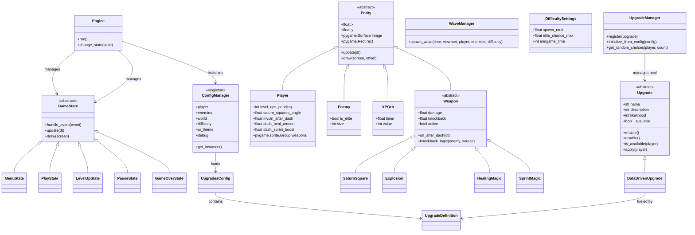

Square Survivor is a modular, Object-Oriented 2D roguelike survival game built with Python and `pygame-ce`. The initial HTML5 prototype was completely decoupled and restructured natively for scalable, standalone Windows `.exe` packaging.

---

## 🕹️ Controls

| Action | Gameplay Key | Menu Key | Controller (PS4/Xbox) |
| :--- | :--- | :--- | :--- |
| **Move / Navigate** | `W, A, S, D` / Arrows | `W, A, S, D` / Arrows | **Left Analog Stick** (Flick) / **D-Pad** |
| **Dash / Confirm** | `SPACE` | `SPACE` / `ENTER` | **X Button** (PS4) / **A Button** (Xbox) |
| **Selection** | Mouse | Mouse Hover | Joystick Movement |
| **Action** | Auto-Attack | Left Click / Key Submit | Confirm Button |
| **Pause / Back** | `ESC` | `ESC` | **Circle (PS4)** / **B (Xbox)** |

---

## 📐 Architecture & Classes

The engine employs a highly decoupled architecture utilizing standard game design patterns like State Machines, Entity Component concepts, and Strategy Registries. 



---

## 🛠️ How to Add New Game Elements

The game is designed to be easily extensible. All major game systems run autonomously and can be appended to.

### 1. Implementing a New Upgrade

The upgrade system uses a **Type Object Pattern**. Adding new power-ups does not require writing new Python classes; instead, you define them in the global configuration.

To add a new upgrade:
1. Open `src/square_survivor/configs/upgrades.json`.
2. Locate the appropriate category (e.g., `player`, `weapon_explosion`).
3. Add a new entry with a unique key.
4. Define the `name`, `description`, `likelihood`, and a list of `effects`.

**Example JSON implementation for "Phase Dash":**
```json
"phase_dash": {
  "name": "Phase Dash",
  "description": "Invulnerability after dash +1s (Max 1.5)",
  "likelihood": 500,
  "is_active": true,
  "one_time": true,
  "effects": [
    { "stat": "invuln_after_dash", "op": "add", "value": 1.0 }
  ],
  "limit": { "stat": "invuln_after_dash", "value": 1.5 }
}
```

**Supported Operations (`op`):**
- `add`: Increments the stat by the value.
- `mul`: Multiplies the stat by the value (use `1.2` for +20%).
- `set`: Directly sets the stat to the value (useful for booleans).

### 2. Balancing & Availability

Upgrades can be dynamically enabled or disabled, and their rarity can be tuned.

**Likelihood (Weights):**
The `likelihood` attribute determines how often an upgrade appears. 
- `likelihood = 100` (Default)
- `likelihood = 10` (Rare, 10x less likely)
- `likelihood = 500` (Common, 5x more likely)

**is_active Flag:**
Set `"is_active": false` in the JSON to completely remove an upgrade from the game without deleting the entry.

**One-Time Upgrades:**
Set `"one_time": true` for upgrades that should only be pickable once (e.g., permanent utility unlocks).

**Stat Limits:**
You can prevent an upgrade from appearing once a stat reaches a certain value:
```json
"limit": { "stat": "upgrade_choices", "value": 7 }
```

---

### 3. Modifying the Upgrade Screen (Level-Up UI)

The visual elements of the upgrade interface live inside the **`LevelUpState`** class, located inside `src/square_survivor/states/level_up.py`.

The UI now supports a **Dynamic Grid Layout** that automatically:
- Respects the player's `upgrade_choices` count.
- Handles up to 7 upgrades simultaneously.
- Wraps buttons after 4 items per row and centers them horizontally and vertically.
- **Keyboard Support**: Fully navigable using `W, A, S, D` with `SPACE` to confirm.

If you want to modify the display:
1. Open `src/square_survivor/states/level_up.py`.
2. Locate the `LevelUpState` class.
3. The layout logic is handled in `__init__`, where `grid_start_y` and `row_start_x` calculate centering based on the number of choices.

### 4. Adjusting Difficulty & Balancing

The game features a data-driven scaling difficulty system. All parameters previously in `constants.py` are now stored as JSON files in `src/square_survivor/configs/`.

**Balancing a Difficulty:**
Open `src/square_survivor/configs/difficulty.json`. You can modify the priorities and individual tier settings:

```json
{
  "priorities": { "Easy": 0, "Normal": 1, "Hard": 2, "Ultra": 3 },
  "tiers": {
    "Normal": {
      "spawn_mult": 1.0,
      "elite_chance_max": 0.6,
      "endgame_time": 120,
      "obstacle_density": 0.005
    }
  }
}
```

**Global Game Settings:**
- **World**: `src/square_survivor/configs/world.json` (Map size, Tile size, MAX XP Orbs).
- **Player/Enemies**: `src/square_survivor/configs/player.json` and `enemy_types.json`.
- **UI Theme**: `src/square_survivor/configs/ui_theme.json`.

### 5. Hot-Reloading & Debugging
You can enable hot-reloading for rapid balancing by editing `src/square_survivor/configs/debug_settings.json`:
- Set `"hot_reload": true` to have the game check for JSON changes every frame.

**Elite Enemy Properties:**
- **Visuals**: Orange (`ELITE_COLOR`), 30px size.
- **HP**: 2x Normal HP.
- **XP**: Drops 2 XP orbs (Double Reward).

### 6. Adding a New Weapon
Weapons are modular entities that handle their own logic and collision interaction.

1. Create a new file in `src/square_survivor/entities/weapons/`.
2. Inherit from `Weapon` (found in `base_weapon.py`).
3. Implement `update()` and `draw()`.
4. Instantiate the weapon and add it to `player.weapons` (a `pygame.sprite.Group`) in `PlayState` or a custom system.

**Example Skeleton:**
```python
class MyWeapon(Weapon):
    def __init__(self, owner, size, damage, knockback):
        super().__init__(owner.x, owner.y, size, damage, knockback)
        self.owner = owner
        # Initialize sprite/image here...

    def update(self, dt):
        # 1. Sync stats from owner (to support live upgrades)
        self.size = getattr(self.owner, "my_weapon_size", self.size)
        self.damage = getattr(self.owner, "my_weapon_damage", self.damage)
        
        # 2. Logic/Movement here
        
        # 3. Lifecycle check
        super().update(dt) 

### 7. Invisible Magic Weapons (Global Utility)

For effects that aren't tied to a physical projectile (like healing or speed boosts), use the **Invisible Weapon** pattern. This ensures the effect stays decoupled from the core `Player` class logic.

1. Create a class inheriting from `Weapon`.
2. Override `on_after_dash(dt)` to implement logic (e.g., `owner.hp += 5`).
3. Set `draw()` to `pass`.
4. Ensure the weapon is added to `player.weapons` in `PlayState` when the corresponding stat (unlocked via upgrade) is greater than zero.

**Example logic for Healing Magic:**
```python
def on_after_dash(self, dt):
    if self.owner.dash_heal_amount > 0:
        self.owner.hp = min(self.owner.max_hp, self.owner.hp + self.owner.dash_heal_amount)
```
```

## 🚀 Building & Packaging

### Windows (.exe)
Whenever you make code adjustments, simply execute the builder script from a powershell terminal:
```powershell
.\.venv\Scripts\python.exe build_exe.py
```
This produces your distribution bundle in `dist/windows/SquareSurvivor.exe`.

### Linux (Standalone Binary)
To build for Linux (Compatible with **Linux Mint 22+**, Ubuntu, and Debian), ensure **Docker Desktop** is running and execute:
```powershell
.\build_linux.ps1
```
This will:
1. Build a Linux-native environment in Docker.
2. Compile a standalone `SquareSurvivor` binary (no extension).
3. Export the file to `dist/linux/SquareSurvivor`.

**To run on Linux**:
1. Copy the file to your Linux machine.
2. In a terminal, run `chmod +x SquareSurvivor`.
3. Launch with `./SquareSurvivor`.
