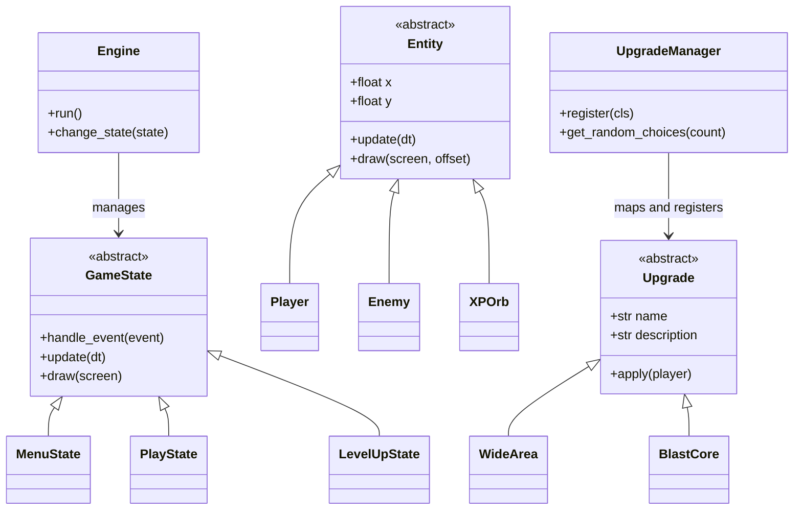

# Square Survivor

Square Survivor is a modular, Object-Oriented 2D roguelike survival game built with Python and `pygame-ce`. The initial HTML5 prototype was completely decoupled and restructured natively for scalable, standalone Windows `.exe` packaging.

## 📐 Architecture & Classes

The engine employs a highly decoupled architecture utilizing standard game design patterns like State Machines, Entity Component concepts, and Strategy Registries. 



---

## 🛠️ How to Add New Game Elements

The game is designed to be easily extensible. All major game systems run autonomously and can be appended to.

### 1. Implementing a New Upgrade

Upgrades use an **Automatic Registry Pattern**. You do not need to wire them into the game's core loop or states manually! 

To add a new power-up variation:
1. Open up `src/square_survivor/systems/upgrade_system.py`.
2. Create a new class that inherits from `Upgrade`.
3. Give it a `name`, a `description` property, and implement what happens inside `apply()`.
4. Drop the `@UpgradeManager.register` decorator exactly above it.

**Example implementation for "Invincibility Buffer":**
```python
# src/square_survivor/systems/upgrade_system.py

@UpgradeManager.register
class IronSkin(Upgrade):
    name = "Iron Skin"
    description = "Permanent +2.0s Invulnerability per Hit"
    
    def apply(self, player: Player):
        # We assume you added 'base_invuln_time' to player.py!
        player.base_invuln_time += 2.0 
```
That's it. Next time you play, the system automatically pulls this upgrade into the randomized pool.

---

### 2. Modifying the Upgrade Screen (Level-Up UI)

The visual elements of the upgrade interface live inside the **`LevelUpState`** class, located inside `src/square_survivor/game_states.py`.

If you want to modify what the Level-Up screen displays (for instance, changing the texts, adjusting colors, or injecting additional logic):
1. Open `src/square_survivor/game_states.py`.
2. Locate the `LevelUpState` class.
3. Scroll down to the `draw(self, screen)` method.

**Modifying the display texts:**
Inside `draw()`, you'll see:
```python
title = self.font.render("LEVEL UP!", True, PRIMARY)
```
Change `"LEVEL UP!"` to whatever you wish. You can also instantiate additional fonts in the `__init__` constructor of `LevelUpState` to draw secondary info (like "Choose wisely..." below the title).

**Modifying the Upgrade Buttons:**
The buttons for each upgrade choice are created in the `LevelUpState.__init__()` loop:
```python
self.buttons.append(Button(bx, by, btn_w, btn_h, upgrade.name, self.btn_font, ...))
```
If you wish to display the `upgrade.description` *inside* the button or below it, you can easily modify the `Button` class inside `src/square_survivor/ui/components.py` to accept and render a secondary description string or draw the `upgrade.description` below the buttons directly inside `LevelUpState.draw()`! Note that if you make structural changes to the Button UI, you will have to adjust `btn_h` to fit your new descriptions properly.

## 🚀 Building & Packaging

Whenever you make code adjustments, simply execute the builder script from a powershell terminal:
```powershell
.venv\Scripts\python.exe build_exe.py
```
This triggers PyInstaller, wraps everything neatly, and produces your distribution bundle in `dist/SquareSurvivor.exe`.
